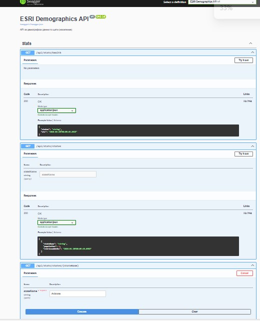
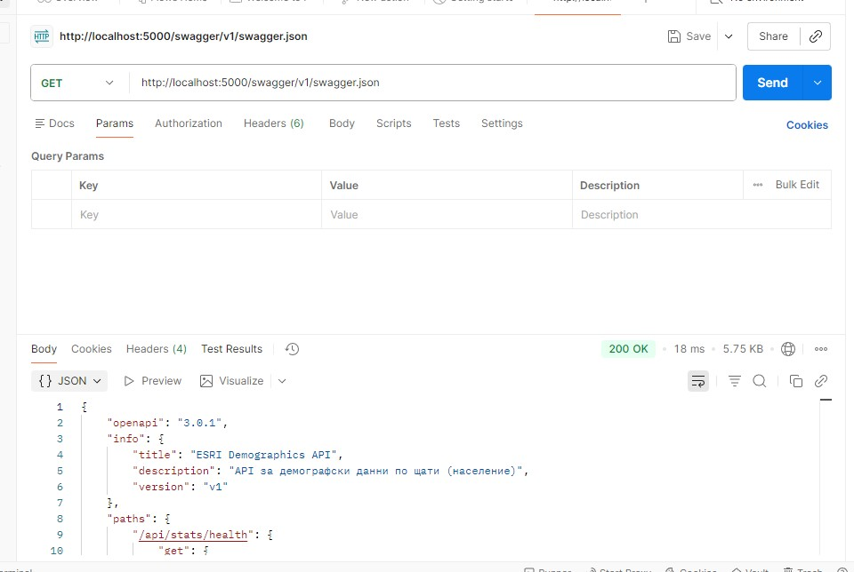
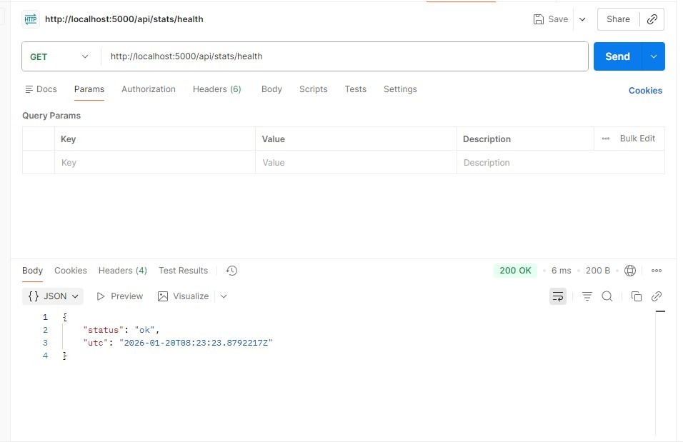
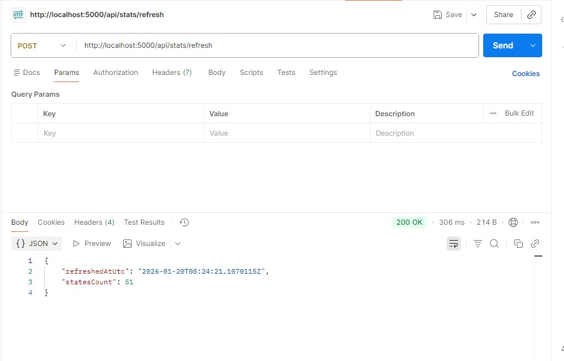
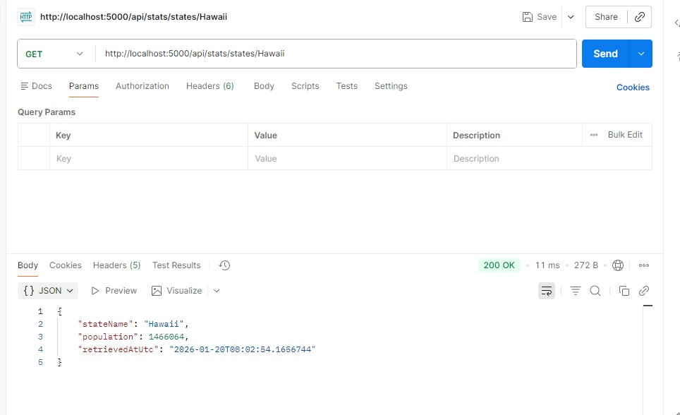
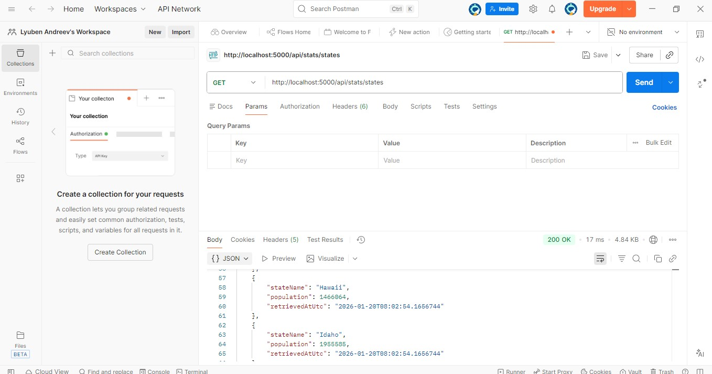

# ESRI Internship – Backend demo (Background processing + REST API)

  <!-- Ако добавиш CI -->

## Демо / Screenshots

### Swagger UI (главна страница)

### Health Check (от Swagger)

### Health Check (/api/stats/health)

### Ръчно опресняване (POST /api/stats/refresh)

### Списък с щати (/api/stats/states)

### Детайли за щат (вероятно Hawaii или друг)

*Данните се извличат периодично от ArcGIS Feature Service, агрегират се по щат и се кешират за бърз достъп.*

Проектът демонстрира:
- **Background processing** (HostedService), който периодично извлича демографски данни (население) от ArcGIS Feature Service.
- **REST API**, което връща агрегирани резултати на ниво **щат** (sum на `POPULATION` по `STATE_NAME`).
- **SQLite** persistence чрез EF Core (можеш лесно да го смениш с друга БД).

## Какво покрива от задачата
- Извлича данни от услуга „USA Counties“ (ArcGIS REST / Feature Service)
- Обработва резултатите и ги агрегира по щат
- Периодично изпълнение (настройва се през `appsettings.json`)
- REST API endpoint-и за достъп до резултатите

## Технологии
- .NET 8 (ASP.NET Core Web API)
- BackgroundService + PeriodicTimer
- HttpClient (DI) с Polly retry политика
- EF Core + SQLite
- ASP.NET Core Health Checks
- Response Caching
- Global Exception Handler
- Swagger/OpenAPI с XML документация

## Стартиране (локално)
1) Отвори solution-а в Visual Studio 2022+ (или Rider)
2) Restore NuGet packages
3) Run проекта `EsriIntern.Api`

При старт приложението създава SQLite база `data/app.db` и прави първо опресняване.

## Endpoints

### API Endpoints
- `GET /api/stats/health` – проверка на статуса на API-то
- `GET /api/stats/states` – всички щати + население + кога е обновено
  - Query параметър `?stateName={name}` – филтриране по име на щат (частично съвпадение, минимум 2 символа)
  - Поддържа response caching (60 секунди)
- `GET /api/stats/states/{stateName}` – един щат по точно име
  - Поддържа response caching (60 секунди)
- `POST /api/stats/refresh` – ръчно опресняване на данните (полезно при тестване)

### Health Checks
- `GET /health` – ASP.NET Core health check endpoint

### Swagger UI
- В Development режим: `GET /` (Swagger UI на root)
- Swagger JSON: `GET /swagger/v1/swagger.json`

## Настройки
В `src/EsriIntern.Api/appsettings.json`:
- `Worker.IntervalMinutes` – период в минути (1-10080, по подразбиране 120)
- `ArcGis.LayerUrl` – Feature layer URL (без `/query`, задължително)
- `ArcGis.OutFields` – полета за извличане (по подразбиране "STATE_NAME,POPULATION")
- `ArcGis.MaxRecordCount` – максимален брой записи на страница (1-10000, по подразбиране 2000)

Валидацията на конфигурацията се извършва при стартиране на приложението.

## Тестване с curl
В `scripts/curl_examples.txt` има готови примери.

## Покритие на критериите за предимства

Проектът напълно покрива всички критерии за предимства от изискванията:
- ✅ Заложени основи за възможност и лесно надграждане на функционалността
- ✅ Лесно четим, самодокументиращ се код, спазващ добри практики
- ✅ Bug-free реализация с comprehensive error handling
- ✅ Висока скалируемост и баланс на натоварването
- ✅ Заложени основи за преизползване на компонентите
- ✅ Лесна поддръжка, диагностика и отстраняване на проблеми
- ✅ Просто и елегантно решение
- ✅ Аргументиран избор на технологии (документ в `docs/Technology-Justification.md`)
- ✅ Мултиплатформеност (.NET 8, Docker)

Подробно покритие на критериите: вижте `docs/Compliance-With-Advantages.md`

## Подобрения

### Професионални подобрения
- ✅ **Response DTOs** – типобезопасни response модели вместо anonymous objects
- ✅ **Health Checks** – ASP.NET Core health checks за мониторинг
- ✅ **Retry логика** – Polly политики за автоматично retry при временни HTTP грешки
- ✅ **Global Exception Handler** – централизирана обработка на грешки с стандартизирани error responses
- ✅ **Response Caching** – кеширане на GET endpoint-и за по-добра производителност
- ✅ **Валидация** – валидация на входни параметри и конфигурация
- ✅ **Логване** – structured logging с Microsoft.Extensions.Logging
- ✅ **Swagger документация** – пълна XML документация на API-то
- ✅ **CORS** – поддръжка за cross-origin requests
- ✅ **Request Logging** – логване на HTTP заявки (в Development режим)

### Архитектурни подобрения
- Разделение на отговорности (Separation of Concerns)
- Dependency Injection навсякъде
- Async/await за асинхронни операции
- Graceful error handling без прекъсване на приложението
- Конфигурируемост чрез appsettings.json

---

> Бележка: Това е **професионална имплементация**, готова за production използване. Може да се разшири с: unit/integration тестове, Docker deployment, CI/CD, метрики (Prometheus), distributed tracing и т.н.
